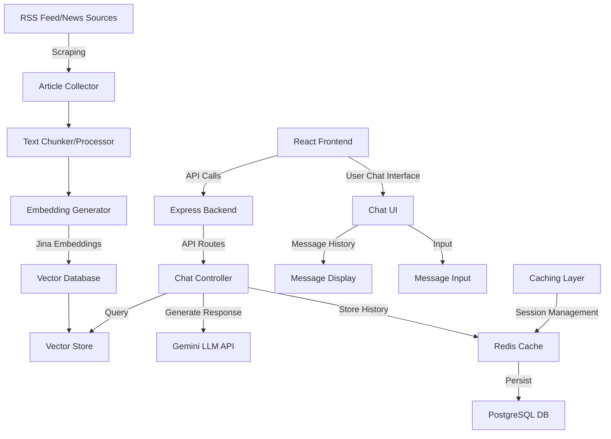

System Arch

```mermaid
graph TD
    A[RSS Feed/News Sources] -->|Scraping| B[Article Collector]
    B --> C[Text Chunker/Processor]
    C --> D[Embedding Generator]
    D -->|Jina Embeddings| E[Vector Database]
    E --> F[Vector Store]

    G[Express Backend] -->|API Routes| H[Chat Controller]
    H -->|Query| F
    H -->|Generate Response| I[Gemini LLM API]
    H -->|Store History| J[Redis Cache]
    J -->|Persist| K[PostgreSQL DB]

    L[React Frontend] -->|API Calls| G
    L -->|User Chat Interface| M[Chat UI]
    M -->|Message History| N[Message Display]
    M -->|Input| O[Message Input]

    P[Caching Layer] -->|Session Management| J
```
